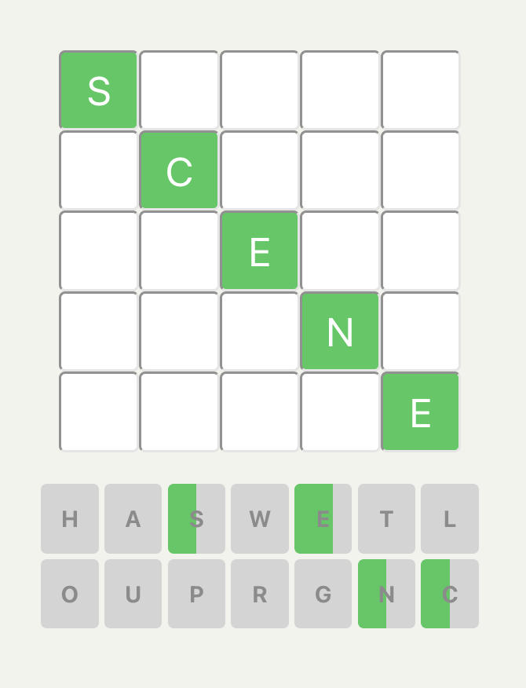
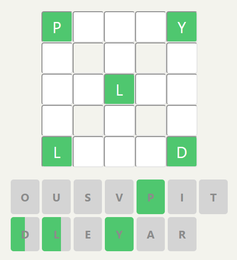
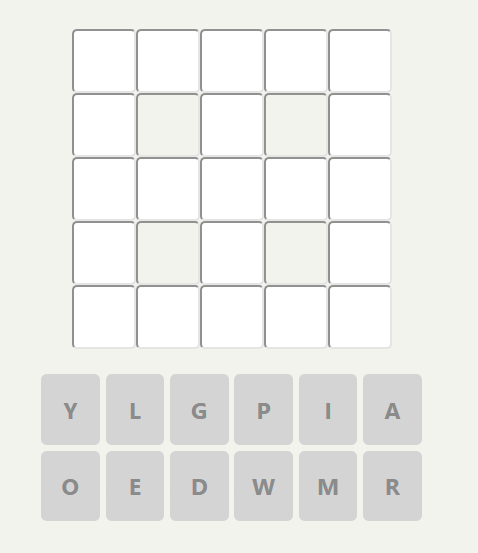

# Crosswordle

<br>


This project was created entirely in React. Solutions under src/data were generated using Python and can be found within this [Github repository](https://github.com/tc1316/crosswordle-solutions)

You can visit the hosted website itself [here](https://crosswordle-production.herokuapp.com)!

## Quickstart

First, clone this repository. Then:

```bash
> npm install
> npm start # Runs the app in the development mode
```

Open [http://localhost:3000](http://localhost:3000) to view the app in your browser.

The page will reload when you make changes.

Then, run the tests to ensure it works:

```bash
> npm test # Launches the test runner in the interactive watch mode
```

See the section about [running tests](https://facebook.github.io/create-react-app/docs/running-tests) for more information.

## Meet the team

---

This project was made by Team Crosswordle. We are:

- Bryn Williams
- Ezekiel Kassim
- Jess Gordon
- Titus Chang

From Makers Cohort November 2021


## About

---

This is a Wordle-inspired webapp created by Team Crosswordle for our Final Engineering Group Project. This application has three game modes: Easy, Normal and Hard, in which the user has to guess the correct 5-letter words according to the ruleset.

For all game modes, the check solution button can be clicked to check the users attempt. Each guess increments the user's guess count, hence a lower guess count indicates a better score.

The letters shown below the grid indicate the characters that are usable for the given daily solution. Note that not all characters are present, giving the user an easier time guessing words.

Colours of the letters in the letter bucket will adjust accordingly i.e. green if the letter is in the correct space, yellow if the letter is in the correct row or column, grey if the letter is in neither the row or column.

A new Crosswordle challenge is provided daily for all three game modes.

## Game modes

---

### Easy mode:

The user is presented with a 5x5 grid with the diagonal characters shown. The user then has to find 5 horizontal words, each of which intercepts with one character in the diagonal.



### Normal mode:

The user is presented with a 5x5 grid with the characters revealed in the 4 corner boxes and the centermost box. The user then has to find 6 words in total: 3 across and 3 down.



### Hard mode:

The user is presented with a 5x5 grid with no revealed characters. Similarly, the user then has to find 6 words in total: 3 across and 3 down.


